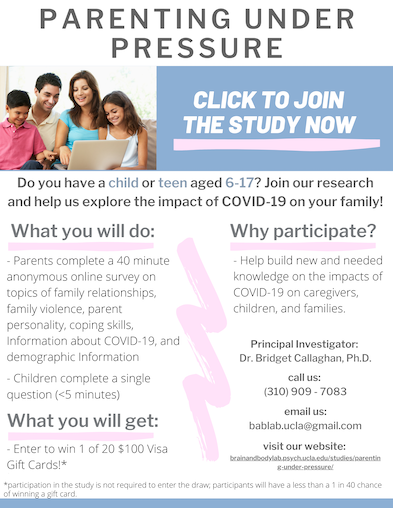
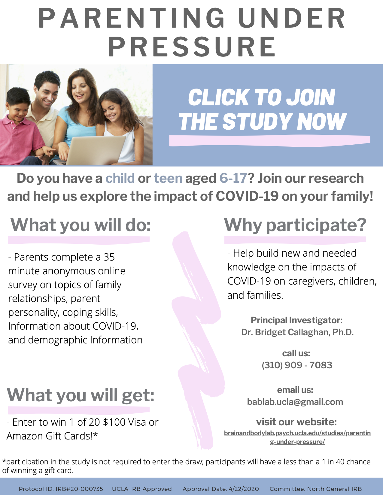
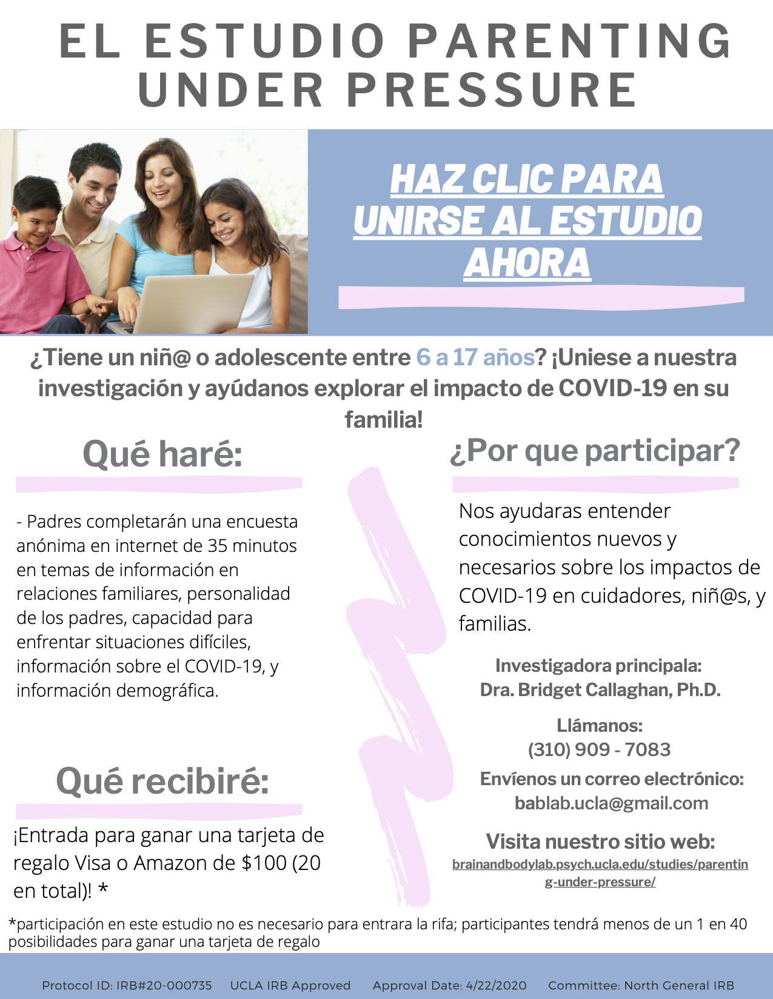

# Methods

## Rationale

Researchers separated PUP 1 (4/27/2020-5/28/2020; participant 159) and PUP 2 (5/29-7/30/2020, participant 324). PUP 2 incorporated a Spanish collection (7/8/2020-7/30/2020). 

## PUP 1 Measures

### Information 

| Title        |  Name       |Description  | Reference  |
| ------- |----------- | ---------------- | ------------ |
| information | COVID-19 Information | This questionnaire identifies information regarding how many children participants have and demographic information regarding the household. | Made by BABLab | 
covid_objective | COVID-19 Objective | This questionnaire identifies health changes from the impacts of the COVID-19 outbreak. | Made by BABLab; adapted from the CASPE- parent (Lacouceur, 2020), the Combined COVID Health Emotional Lifestyle Changes (Pfiefer, 2020), and the COVID Lifestyle Changes (Pfiefer, 2020)
| demographics | Demographics | This questionnaire consists of 23 items to identify the child's age, caregiver information, parental socioeconomic status, underlying health conditions, and geographic location. This questionnaire also contains the MacArthur Scale of Subjective Social Status, which assesses the sense of social status across factors of socioeconomic status by asking individuals to place an "X" on the area of the "social ladder" they feel they most identify. | (Adler et al., 2000)

### Affect

| Title        |  Name       |Description  | Reference  |
| ------- |----------- | -------------------- | -------- |
| PANAS | Positive and Negative Affect Schedule- Parent Self-Report | This self-report questionnaire consists of 20 items measuring both positive and negative affect. The questionnaire asks participants to rate each item on a 5-point scale of 1 (not at all) to 5 (very much) indicating the way they have felt over the past week. | (Watson et al., 1988)
| Written Reponse | COVID-19 Written Response- Parent | This self-report measure consists of one long-form qualitative response, prompting a parent to write continuously for five minutes about the impacts of COVID-19 on their life and family.| Made by BABLab; adapted from (Pennebaker, 1997)

### Anxiety

| Title        |  Name       |Description  | Reference  |
| ------- |----------- | -------------------- | -------- |
| RCADS--P | Revised Children's Anxiety and Depression Scale--Parent Proxy | This 47 item questionnaire contains subscales of separation anxiety disorder, social phobia, panic disorder, low mood, obsessive compulsive disorder, and generalized anxiety disorder. The scale asks participants to rate how often their child experiences each item. | (Chorpita et al., 2000)
| STAI | Shortened State-Trait Anxiety Inventory-Parent Self-Report | This Inventory contains a shortened State-Trait Anxiety Inventory, with 6 total items detailing state anxiety. The inventory asks participants to rate how often they feel each item, in the context of how the participant feels currently. | (Spielberger et al., 1983)

### Early Life Stress

| Title        |  Name       |Description  | Reference  |
| ------- |----------- | -------------------- | -------- |
| TESI-PRR | Traumatic Events Screening Inventory - Parent Report Revised | The TESI-PRR assesses a child's/adolescent’s experience of a variety of potential traumatic events including previous injuries, hospitalizations, domestic violence, community violence, disasters, accidents, abuse.| (Ghosh-Ippen et al., 2002)

### Fear

| Title        |  Name       |Description  | Reference  |
| ------- |----------- | -------------------- | -------- |
| FIVE-Parent Report | Fear of Illness and Virus Evaluation- Parent Proxy Report | This is a 35-item parent report questionnaire constructed to measure child fear of illness and virus. This questionnaire lists items related to fears about contamination, illness, and social distancing, and behaviors and impacts related to these illness and virus fears and asks participants to rate on a scale of 1-4 how often they are afraid of each item within the last week. | (Ehrenreich-May, 2020)
| FIVE- Adult Report | Fear of Illness and Virus Evaluation- Parent Self-Report | This is a 35-item parent report questionnaire constructed to measure adult fear of illness and virus. This questionnaire lists items related to fears about contamination, illness, and social distancing, and behaviors and impacts related to these illness and virus fears and asks participants to rate on a scale of 1-4 how often they are afraid of each item within the last week. | (Ehrenreich-May, 2020)
| GMF-PR | General Medical Fears Questionnaire- Parent Proxy Report | This 7-item questionnaire is designed to evaluate child general medical fear. The measure asks participants to rate each item on a scale of 1-3 how much they fear each item. | Made by BABLab; adapted from the Revised Fear Survey Schedule for Children (FSSC-R) (Ollendick, 1983) 
| GMF-SR| General Medical Fears Questionnaire- Parent Self-Report | This 7-item questionnaire is designed to evaluate parent general medical fear. The measure asks participants to rate each item on a scale of 1-3 how much they fear each item. | Made by BABLab; adapted from the FSSC-R (Ollendick, 1983)

### Parent-Child Relationship

| Title        |  Name       |Description  | Reference  |
| ------- |--------- | ---------- | ------------------- |
| PCRQ | Parent Child Relationship Questionnaire- Parent Report Form | This is a 27-item questionnaire designed to measure the quality and security of the parent and child relationship. The questionnaire asks participants to rate on a scale of 1-5 how much each statement applies to him/her. | Made by BABLab; adapted from the Emotional Availability Self Report (Biringen et al., 1998), Network of Relationships Inventory (Furman & Buhrmester, 2009), Parental Reflective Functioning Questionnaire (Luyten, et al., 2017), Parent Emotion Regulation Scale (Pereira et al., 2017), Child Parent Relationship Scale (Pianta, 1992), and the Attachment Q-Sort Observational Measure (Waters & Deane, 1985)

### Parental Buffering

| Title        |  Name       |Description  | Reference  |
| ------- |----------- | ---------------- | ----------- |
| PBQ | Parental Buffering Questionnaire- Parent Report Form | This questionnaire contains three blocks to assess parental buffering in child stress. The first block contains 6 items to assess parental belief in being effective buffers, prompting participants to rate on a scale of 1-7 to which they agree or disagree. The second block contains 15 items of buffering actions, with a scale of 1-7 measuring how often these actions occur and a scale of 1- 6 measuring effectiveness of each action. The third block contains a qualitative response about parent buffering of child stress. | Made by BABLab; adapted from the Early Intervention Parenting Self-Efficacy Scale (Guimond et al., 2008), CASPE-Parent (Lacouceur, 2020), PERS (Pereira et al., 2017), and the Modified KIDCOPE (Pfiefer & Lewis, 2020)
| BIQ | Buffering Information Questionnaire- Parent Proxy Form | This 2 item questionnaire assesses whether parents feel they have access to adequate information to support their child's psychological health during COVID-19 and the sources of this information. | Made by BABLab

### Parenting Stress

| Title        |  Name       |Description  | Reference  |
| ------- |----------- | ------------------ | -------------- |
| PSCQ | Parenting Stress Covid-19 Questionnaire - Parent Report Form | his questionnaire consists of two blocks, separating the evaluation of parental stress prior to COVID-19 with 4 items, and during COVID-19 with 6 items. The questionnaire asks participants to rate on a scale of 1-5 how much they agree with each item related to parental stress. | Made by BABLab; adapted from the Parental Stress Scale (Berry & Jones, 1995), COVID-19 Adolescent Symptom & Psychological Experience Questionnaire- Parent (Ladouceur, 2020), and the Adolescent Social Connection & Coping During COVID-19 Questionnaire (Pfiefer, 2020)
| RDAS | Revised Dyadic Adjustment Scale | Used to assess the quality of the parents' relationship (if applicable). 14-item self report questionnaire that assesses seven dimensions of couple relationships within three overarching categories including "Consensus" in decision making, values and affection, "Satisfaction" in the relationship with respect to stability and conflict regulation, and "Cohesion" as seen through activities and discussion. Respondents rate certain aspects of their relationship on a 5 or 6 point scale. | (Busby et al., 1995)

### Threat Information

| Title        |  Name       |Description  | Reference  |
| ------- |----------- | ------------- | ------------ |
| SOI | Sources of Information about COVID-19 Scale- Parent Proxy Report | his 9-item questionnaire is designed to evaluate the sources of information in which children are receiving about COVID-19. The scale lists items related to parent threat information, media, school, friends and asks participants to rate on a scale of 1-5 how true each item about the source of information their child receives. | Made by BABLab; adapted from the Sources of Information about Swine Flu Scale (Remmerswaal & Muris, 2011)

-----------

## PUP 2 Measures

### Information 

| Title        |  Name       |Description  | Reference  |
| ------- |----------- | --------------- | ------------ |
| information | COVID-19 Information | This questionnaire identifies information regarding how many children participants have and demographic information regarding the household. | Made by BABLab | 
covid_objective | COVID-19 Objective | This questionnaire identifies health changes from the impacts of the COVID-19 outbreak. | Made by BABLab; adapted from the CASPE- parent (Lacouceur, 2020), the Combined COVID Health Emotional Lifestyle Changes (Pfiefer, 2020), and the COVID Lifestyle Changes (Pfiefer, 2020)
| demographics | Demographics | This questionnaire consists of 23 items to identify the child's age, caregiver information, parental socioeconomic status, underlying health conditions, and geographic location. This questionnaire also contains the MacArthur Scale of Subjective Social Status, which assesses the sense of social status across factors of socioeconomic status by asking individuals to place an "X" on the area of the "social ladder" they feel they most identify. | (Adler et al., 2000)

### Fear

| Title        |  Name       |Description  | Reference  |
| ------- |----------- | -------------------- | -------- |
| FIVE-Parent Report | Fear of Illness and Virus Evaluation- Parent Proxy Report | This is a 35-item parent report questionnaire constructed to measure child fear of illness and virus. This questionnaire lists items related to fears about contamination, illness, and social distancing, and behaviors and impacts related to these illness and virus fears and asks participants to rate on a scale of 1-4 how often they are afraid of each item within the last week. | (Ehrenreich-May, 2020)
| FIVE- Adult Report | Fear of Illness and Virus Evaluation- Parent Self-Report | This is a 35-item parent report questionnaire constructed to measure adult fear of illness and virus. This questionnaire lists items related to fears about contamination, illness, and social distancing, and behaviors and impacts related to these illness and virus fears and asks participants to rate on a scale of 1-4 how often they are afraid of each item within the last week. | (Ehrenreich-May, 2020)

### Parent-Child Relationship

| Title        |  Name       |Description  | Reference  |
| ------- |--------- | ------------ | ----------------- |
| PCRQ | Parent Child Relationship Questionnaire- Parent Report Form | This is a 27-item questionnaire designed to measure the quality and security of the parent and child relationship. The questionnaire asks participants to rate on a scale of 1-5 how much each statement applies to him/her. | Made by BABLab; adapted from the Emotional Availability Self Report (Biringen et al., 1998), Network of Relationships Inventory (Furman & Buhrmester, 2009), Parental Reflective Functioning Questionnaire (Luyten, et al., 2017), Parent Emotion Regulation Scale (Pereira et al., 2017), Child Parent Relationship Scale (Pianta, 1992), and the Attachment Q-Sort Observational Measure (Waters & Deane, 1985)

### Parental Buffering

| Title        |  Name       |Description  | Reference  |
| ------- |----------- | ----------------- | ----------- |
| PBQ | Parental Buffering Questionnaire- Parent Report Form | This questionnaire contains three blocks to assess parental buffering in child stress. The first block contains 6 items to assess parental belief in being effective buffers, prompting participants to rate on a scale of 1-7 to which they agree or disagree. The second block contains 15 items of buffering actions, with a scale of 1-7 measuring how often these actions occur and a scale of 1- 6 measuring effectiveness of each action. The third block contains a qualitative response about parent buffering of child stress. | Made by BABLab; adapted from the Early Intervention Parenting Self-Efficacy Scale (Guimond et al., 2008), CASPE-Parent (Lacouceur, 2020), PERS (Pereira et al., 2017), and the Modified KIDCOPE (Pfiefer & Lewis, 2020)
| BIQ | Buffering Information Questionnaire- Parent Proxy Form | This 2 item questionnaire assesses whether parents feel they have access to adequate information to support their child's psychological health during COVID-19 and the sources of this information. | Made by BABLab

### Threat Information

| Title        |  Name       |Description  | Reference  |
| ------- |----------- | -------------------- | -------- |
| SOI | Sources of Information about COVID-19 Scale- Parent Proxy Report | his 9-item questionnaire is designed to evaluate the sources of information in which children are receiving about COVID-19. The scale lists items related to parent threat information, media, school, friends and asks participants to rate on a scale of 1-5 how true each item about the source of information their child receives. | Made by BABLab; adapted from the Sources of Information about Swine Flu Scale (Remmerswaal & Muris, 2011)

*Note: In order to reach a wider audience, all questionnaires in PUP 2 were translated into Spanish by members of our research team. These translations were then approved by native speakers of the language.*

-----------

## Procedure

### Recruitment

Participants were recruited online via postings on Craigslist and NextDoor and digital marketing efforts on the [LA Virtual Camp Fair Website](https://www.vcampfair.com/brain-and-body-lab-ucla.html). Postings were made on social media, via Facebook paid advertisement, in Facebook parent forums, Instagram, LinkedIn, and Twitter. Recruitment efforts also included emailing listservs and community stakeholders/research collaborators for distribution, contacting local school boards, and creating press releases for local (community postings on Patch) news distribution.

Participants who enroll in the study will be placed in a raffle to win one of twenty $100 Visa or Amazon gift cards by providing an email address following completion of the study. Participants do not have to complete or enroll in the study to go in the draw to receive the gift card.

The following materials were used:

-------------

### Timing 

PUP 1 took approximately 60 minutes to complete, including 5 minutes of child self-report following the Written Response COVID-19 prompt. PUP 2 was shortened to approximately 35 minutes and did not include a qualitative written section.

-----------------------

### PUP 1 Questionnaire Order

1. Participant
2. COVID-19 Information
3. FIVE
4. SOI
5. GMF
6. PCRQ
7. PSCQ
8. BIQ
9. PBQ
10. TESI
11. Demographics
12. STAI
13. RCADS
14. PANAS (Pre- assessment)
15. Parental Written Response
16. PANAS (Post- assessment)
17. Child Written Response
(if applicable, #18-20)
18. Child #2 Written Response
19. Child #3 Written Response
20. Child #4 Written Response
21. Resources

-----------------------

### PUP 2 Questionnaire Order

1. Participant
2. Information
3. FIVE
4. SOI
5. PCRQ
6. BIQ
7. PBQ
8. Demographics
9. Resources

------------

### PUP 1 Attention Checks

1. FIVE
2. PCRQ
3. PBQ
4. TESI
5. RCADS

------------

### PUP 2 Attention Checks

1. FIVE
2. PCRQ
3. PBQ

------------
